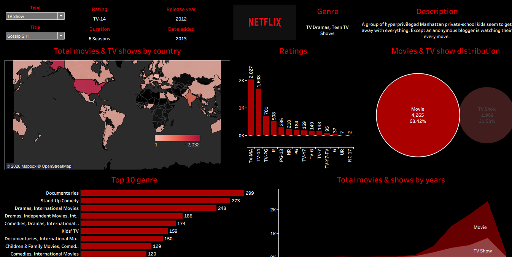

# Netflix Content Analytics Dashboard

## Project Overview

This Tableau dashboard analyzes Netflix Movies and TV Shows using interactive visualizations.

## Dashboard Features

- Filter by Movie/TV Show
- Filter by Title
- Country-wise Content Distribution
- Ratings Distribution
- Top 10 Genres
- Movies vs TV Shows
- Release Year Trend

## Tools Used

- Tableau
- Excel / CSV

## Dashboard Preview

## Dataset

Netflix Titles Dataset

## Key Insights

- Movies account for over 68% of Netflix titles.
- TV-14 is the most common rating.
- The United States has the largest Netflix catalog.
- Documentaries are among the most common genres.